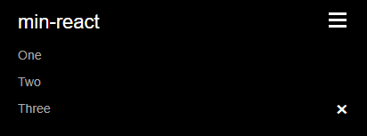

Custom forms with customizable and responsive components

=== "Code"

    ``` html
    <Navbar>
        <Navbar.Name href="/">min-react</Navbar.Name>
        <a href="#">One</a>
        <a href="#">Two</a> 
        <a href="#">Three</a>
    </Navbar>
    <Navbar.CloseButton>×</Navbar.CloseButton>
    ```

=== "Result"

    
      
    

!!! info 
    The `CloseButton` component is a special component that is only used in the mobile version of the navbar. It is optional and not required to use.