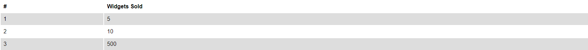

Beautifull and customizable tables

=== "Code"

    ``` html
    <Table>
        <thead>
            <tr>
            <th>#</th>
            <th>Widgets Sold</th>
          </tr>
        </thead>
        <tbody>
          <tr>
            <td>1</td>
            <td>5</td>
          </tr>
          <tr>
            <td>2</td>
            <td>10</td>
          </tr>
          <tr>
            <td>3</td>
            <td>500</td>
          </tr>
        </tbody>
    </Table>
    ```

=== "Result"

    

!!! info 
    There are no special components for the table's content. More information about the table content can be found [here](https://www.w3schools.com/html/html_tables.asp).